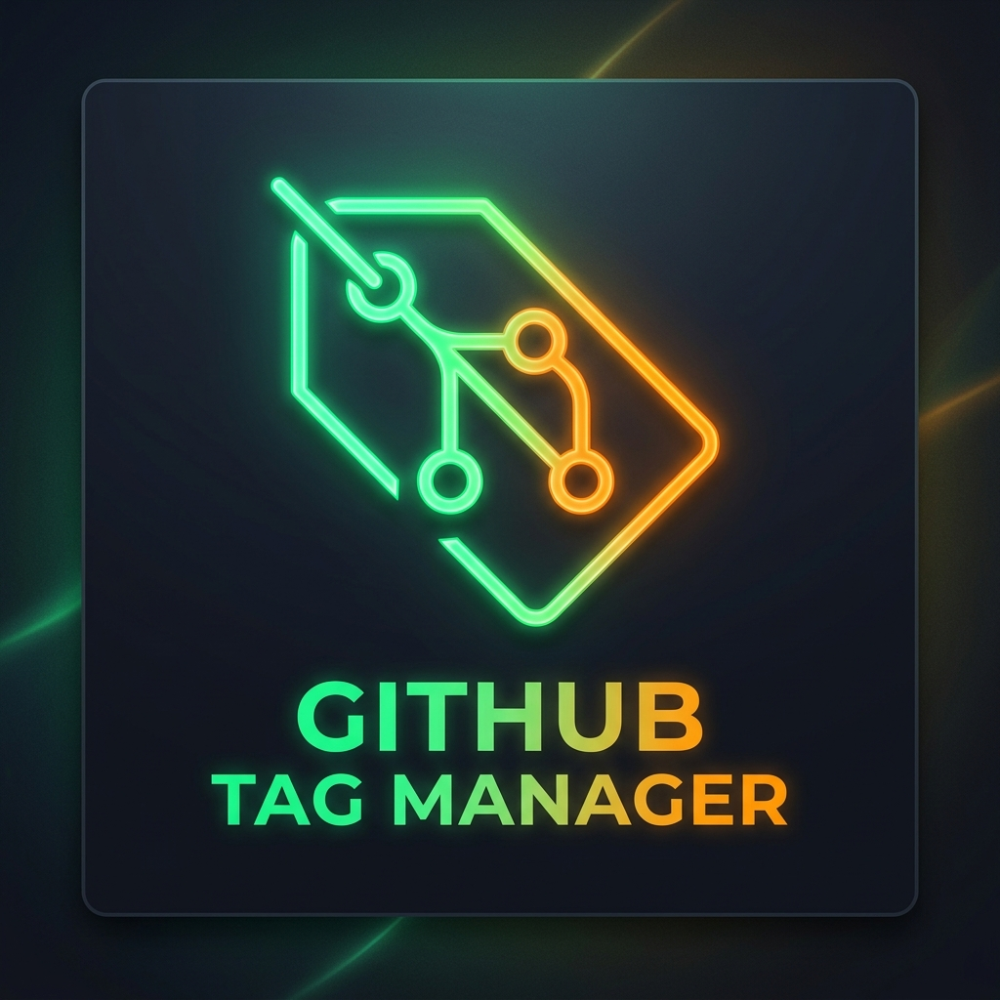
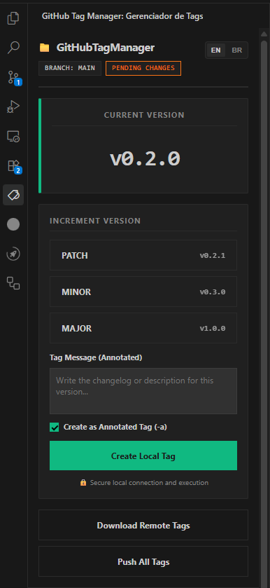
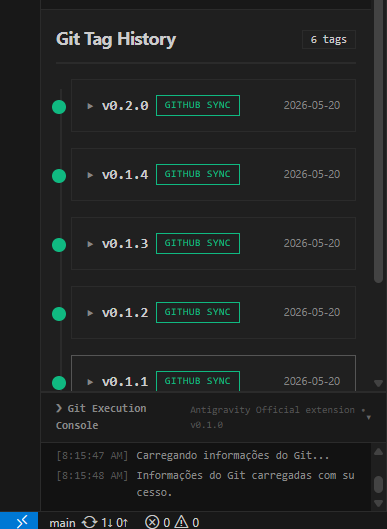

  

  
  
  
  
  

# GitHub Tag Manager

A language-agnostic, visual VS Code / Antigravity IDE extension to manage local and remote Git tags and semantic versioning (SemVer) directly from your left activity bar.

  
  

---

## Features / Funcionalidades

### English
* 📂 **Left Sidebar View**: Deeply integrated into the IDE activity bar, adapting to your theme and panel size.
* 🏷️ **SemVer Bumping**: Automatic calculation of version bumps (Patch, Minor, Major) supporting multi-digit tags (e.g. `v1.35` -> `v1.36`).
* 🌐 **Bilingual Interface (EN / BR)**: Auto-detects your IDE language, allows manual toggling (EN/BR), and persists preferences.
* 🗂️ **Interactive History Timeline**: Click tags to expand, view full descriptions, and perform actions.
* 🔒 **Safe Actions**: Block accidental modifications on tags already pushed to remote, and delete local tags safely with confirmation dialogs.

### Português (Brasil)
* 📂 **Painel na Barra Lateral Esquerda**: Totalmente integrado à barra de atividades da IDE, ajustando-se dinamicamente ao espaço disponível.
* 🏷️ **Versionamento Semântico (SemVer)**: Cálculo inteligente para incrementos de versão (Patch, Minor, Major) mantendo consistência de dígitos.
* 🌐 **Interface Bilíngue (EN / BR)**: Detecção automática baseada no idioma da IDE com chaveamento manual por botões e persistência.
* 🗂️ **Histórico Colapsável**: Timeline interativa onde clicar em uma tag revela sua descrição e botões de ação associados.
* 🔒 **Segurança**: Bloqueio de ações destrutivas para tags enviadas e diálogos nativos de confirmação para remoção local.

---

## Security & Operation / Segurança e Funcionamento

### English
> [!NOTE]
> The extension interacts directly with the local Git CLI on your machine inside the opened workspace directory. It **does not store, collect, or transmit any credentials, access tokens, or repository details**. All remote operations (such as `push` or `fetch`) rely entirely on your existing local Git configuration (SSH keys, credentials helper, etc.).

### Português (Brasil)
> [!NOTE]
> A extensão interage diretamente com o CLI local do Git na sua máquina, rodando dentro da pasta do projeto aberto. Ela **não armazena, coleta ou transmite credenciais, tokens de acesso ou informações do repositório**. Todas as operações remotas (como `push` ou `fetch`) utilizam as configurações já existentes do seu Git local (chaves SSH, gerenciador de credenciais, etc.).

---

## Telemetry / Telemetria

### English
> [!IMPORTANT]
> **Anonymous Telemetry (Opt-In):**
> Starting in version `0.4.0`, this extension includes optional telemetry powered by PostHog to collect anonymous usage data (e.g., tracking tag creation, push, and deletion events) to help us improve the tool.
> * Telemetry is **disabled by default** (strict opt-in).
> * The extension does **not** read or transmit any of your project's source code, credentials, or personal information.
> * You can enable or disable telemetry at any time via the extension setting: `github-tag-manager.telemetry.enabled`.

### Português (Brasil)
> [!IMPORTANT]
> **Telemetria Anônima (Opt-In):**
> A partir da versão `0.4.0`, esta extensão inclui telemetria opcional via PostHog para coletar dados anônimos de uso (como eventos de criação, envio e exclusão de tags) para nos ajudar a melhorar a ferramenta.
> * A telemetria vem **desabilitada por padrão** (opt-in estrito).
> * A extensão **não** lê ou transmite o código-fonte do seu projeto, credenciais ou informações pessoais.
> * Você pode ativar ou desativar a telemetria a qualquer momento através da configuração da extensão: `github-tag-manager.telemetry.enabled`.

---
## How to Use / Como Usar

### English
1. Open any Git repository in VS Code or Antigravity IDE.
2. Click the **Tag icon** on the left activity bar to open the side panel.
3. Select an increment type (PATCH, MINOR, MAJOR) and type an optional tag message.
4. Click **Create Local Tag**.
5. Click any tag on the **History** timeline to expand details:
   - Click **Push to GitHub** to send the tag to the remote repository.
   - Click **Delete Local** to remove the tag (available only if it hasn't been pushed yet).

### Português (Brasil)
1. Abra qualquer repositório Git no seu VS Code ou Antigravity IDE.
2. Clique no **ícone de Tag** na barra de atividades lateral para abrir o gerenciador.
3. Escolha o tipo de incremento (PATCH, MINOR, MAJOR) e digite uma descrição opcional.
4. Clique em **Gerar TAG Local**.
5. Clique em qualquer item no **Histórico** para expandir:
   - Use o botão **Push para GitHub** para enviar a tag individual ao remoto.
   - Use o botão **Excluir Local** para remover tags locais (desabilitado se já enviadas ao remoto).

---

## License / Licença

Distributed under the [MIT License](LICENSE).
